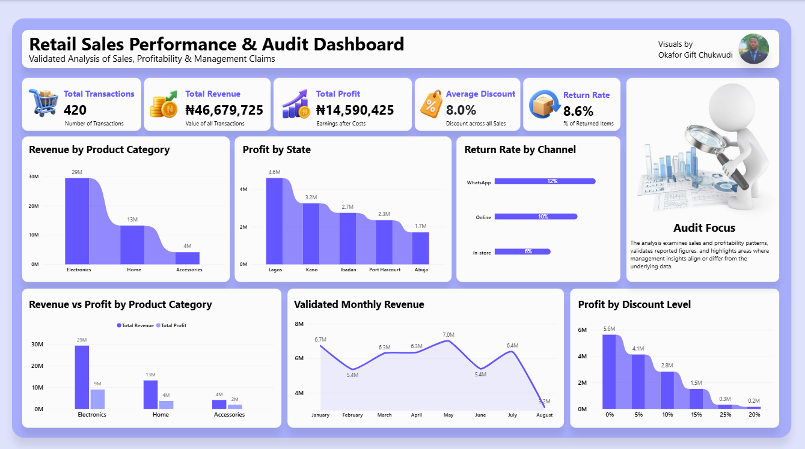
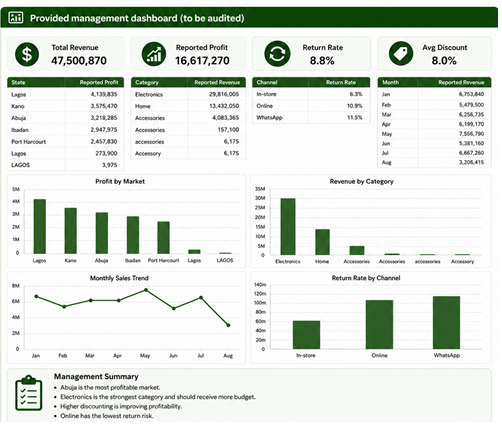

# Retail Sales Performance & Dashboard Audit

> A retail dashboard can look polished and still lead decision-makers to the wrong conclusions.



## Project Overview

This project is a data quality and dashboard audit of a retail sales management report.

The goal was to go beyond simply checking whether the dashboard looked correct. I went back to the underlying transaction data, validated the reported figures, identified data quality issues, tested management claims, and rebuilt the dashboard using cleaned and validated data.

The project combines **data cleaning, financial validation, business analysis, and Power BI dashboard development** to assess whether the information presented to management could be reliably used for decision-making.

## Business Problem

The original retail dashboard presented key performance indicators, sales trends, profitability figures, and management conclusions intended to support business decision-making.

However, a dashboard can appear convincing while still containing underlying data quality issues or conclusions that are not fully supported by the data.

This raised several questions:

- Are the reported financial figures accurate?
- Are there duplicate or incomplete records affecting the analysis?
- Do the management conclusions actually align with the underlying data?
- Can the reported revenue and profitability figures be trusted?
- Is the dashboard reliable enough to support management decisions?

To answer these questions, I conducted a structured audit of the underlying transaction data and rebuilt the analysis using validated figures.

## Project Objectives

The main objectives of this project were to:

1. **Audit the quality of the underlying retail transaction data.**
2. **Identify and resolve data issues** such as duplicate records, missing values, and inconsistent categorical entries.
3. **Validate reported revenue and profitability figures** against independently calculated values.
4. **Evaluate management claims** and determine whether they were supported by the underlying data.
5. **Rebuild the dashboard** using cleaned and validated data.
6. **Compare the original management dashboard with the corrected analysis.**
7. **Communicate the findings in a way that supports more reliable business decision-making.**

## Tools & Technologies

- **Power BI** — Dashboard development, data visualization, and reporting
- **Power Query** — Data cleaning, transformation, validation, and preparation
- **DAX** — Measures and analytical calculations in Power BI
- **Microsoft Excel** — Data inspection, validation, and supporting analysis

## Data Quality Audit

The original dataset contained **432 transaction records** across 16 columns. Before analysing the business performance, I performed a data quality audit to identify issues that could affect the reliability of the dashboard.

### Key Data Quality Issues Identified

| Issue | Finding | Action Taken |
|---|---:|---|
| Duplicate Transactions | 12 exact duplicate records | Removed duplicate occurrences |
| Missing Cost per Unit | 31 records (7.38%) | Recovered using a validated product-cost reference |
| Inconsistent Categories | Multiple naming variants | Standardized category labels |
| Inconsistent Locations | Multiple naming/casing variants | Standardized state/location labels |
| Revenue Discrepancies | 22 of 420 transactions (5.24%) | Recalculated and reconciled against reported revenue |

After removing duplicates, the validated dataset contained **420 unique transactions**.

### Missing Cost Validation

The 31 missing Cost per Unit values were recovered using a product-level reference created from the available valid records.

The dataset contained **9 distinct products**, each with a consistent product-specific cost. This allowed the missing cost values to be validated and restored without introducing arbitrary estimates.

### Revenue Validation

Reported revenue was independently recalculated using:

**Calculated Revenue = Units × Unit Price × (1 − Discount)**

The validation showed:

- **398 transactions (94.76%)** reconciled exactly.
- **22 transactions (5.24%)** did not reconcile.
- Reported Revenue: **₦46,369,970**
- Calculated Revenue: **₦46,679,725**
- Revenue Variance: **−₦309,755**

The reported Revenue field was therefore retained for audit purposes but was not used as the primary basis for the corrected dashboard.

## Financial Validation

To assess the reliability of the reported financial figures, I created independent revenue, cost, and profit calculations from the validated transaction data.

### Calculated Financial Fields

**Total Cost**

Cost per Unit × Units

**Calculated Revenue**

Units × Unit Price × (1 − Discount)

**Calculated Profit**

Calculated Revenue − Total Cost

This allowed the reported figures to be compared with independently calculated values rather than relying solely on the original dashboard metrics.

### Validated Financial Results

| Metric | Reported / Original | Validated |
|---|---:|---:|
| Revenue | ₦47,500,870 | ₦46,679,725 |
| Profit | ₦16,617,270 | ₦14,590,425 |
| Return Rate | 8.8% | 8.6% |

The differences demonstrate why financial metrics should be validated against the underlying transaction data before being used for management decision-making.

## Key Findings

The validated analysis produced the following results:

- **Total Transactions:** 420
- **Total Revenue:** ₦46,679,725
- **Total Profit:** ₦14,590,425
- **Profit Margin:** 31.3%
- **Average Discount:** 8.0%
- **Return Rate:** 8.6%

### Business Performance Highlights

- **Lagos State** generated the highest total profit at **₦4,579,900**.
- **Electronics** generated the highest revenue at **₦29,346,500**.
- **May** recorded the highest monthly revenue at **₦7,008,500**.
- **In-store** had the lowest return rate at approximately **6%**.
- **WhatsApp** had the highest return rate at approximately **12%**.
- Total profit generally declined as discount levels increased, although this analysis shows association rather than causation.

## Management Claims Audit

Beyond validating the numbers, I evaluated whether the conclusions presented to management were actually supported by the underlying data.

| # | Management Claim | Classification | Audit Finding |
|---|---|---|---|
| 1 | Abuja is the most profitable market. | **Incorrect** | Lagos State generated the highest validated profit at ₦4,579,900, while Abuja generated ₦1,698,100. |
| 2 | Electronics is the strongest-performing category and should receive more budget. | **Misleading** | Electronics generated the highest revenue and profit, but the available analysis does not provide enough evidence to conclude that additional budget should automatically be allocated to it. |
| 3 | Higher discounting is improving profitability. | **Incorrect** | Total profit generally declined as discount levels increased. The analysis shows association, not causation. |
| 4 | Online has the lowest return rate. | **Incorrect** | In-store had the lowest validated return rate at approximately 6%, compared with approximately 10% for Online and 12% for WhatsApp. |
| 5 | August is the strongest sales month. | **Incorrect** | May recorded the highest validated monthly revenue at ₦7,008,500. |
| 6 | Lagos is underperforming compared with other markets. | **Incorrect** | Lagos State generated the highest validated total profit at ₦4,579,900. |
| 7 | The reported Revenue field can be used directly for decision-making. | **Incorrect** | 22 of 420 transactions (5.24%) did not reconcile with independently calculated revenue. |
| 8 | The dashboard is sufficiently reliable for management to act on without further data cleaning. | **Incorrect** | Duplicate records, missing cost data, inconsistent categorical values, and revenue discrepancies required cleaning and validation before the figures could be relied upon. |

## Corrected Dashboard

After completing the data cleaning and validation process, I rebuilt the dashboard in Power BI using the validated figures.

The corrected dashboard focuses on:

- Revenue performance
- Profitability
- Monthly sales trends
- Product category performance
- Profit by state
- Return rates by channel
- Profit across discount levels
- Revenue versus profit by category


## Original Management Dashboard

The original management dashboard was used as the reference point for the audit.

It presented the reported financial metrics and management conclusions that were tested against the underlying transaction data.



## Dashboard Comparison

The audit revealed an important distinction between **data quality** and **business interpretation**.

Not every trend changed after the data was cleaned.

Some of the broad patterns remained consistent, such as Electronics being the strongest revenue-generating category. However, several reported figures changed after validation, and some management conclusions did not align with either the underlying data or the dashboard visuals.

This reinforced an important principle:

> **A dashboard should not only present numbers; its conclusions should also be supported by the data.**

## Key Takeaways

This project reinforced several important lessons about data analytics and business intelligence:

### 1. Data quality comes before visualization

A polished dashboard cannot compensate for duplicate, incomplete, inconsistent, or inaccurate data.

### 2. Reported figures should be validated

The Revenue Reported field appeared complete, but 22 transactions failed reconciliation when compared with independently calculated revenue.

### 3. A dashboard can contain correct visuals but misleading conclusions

Some management claims conflicted with the actual values shown by the dashboard or with the validated analysis.

### 4. Correlation should not automatically become a business recommendation

For example, higher discounts were associated with lower total profit, but the analysis alone cannot establish that discounts caused the decline.

### 5. Good analytics requires questioning the story behind the numbers

The goal of the audit was not simply to find errors. It was to determine whether the information presented to decision-makers could be trusted and whether the conclusions were supported by evidence.

## Repository Structure

```text
retail-sales-dashboard-audit/
│
├── README.md
│
├── images/
│   ├── corrected-dashboard.png
│   └── original-dashboard.png
│
└── documentation/
    ├── data-quality-audit.md
    ├── management-claims-audit.md
    └── methodology.md
```

---

## Data Availability

The underlying dataset and Power BI `.pbix` file are not included in this repository.

The source data was provided as part of a bootcamp project and is therefore not being redistributed publicly.

This repository instead contains the dashboard screenshots and documentation of the data cleaning, validation,
analytical methodology, and findings.

## Conclusion

This project demonstrates how data analytics goes beyond building visually appealing dashboards.

By combining **data cleaning, validation, financial reconciliation, business analysis, and dashboard development**, I was able to identify weaknesses in the original reporting process and rebuild the analysis using validated figures.

The biggest lesson from the project was simple:

> **Before making decisions from a dashboard, make sure the data—and the story being told from that data—can be trusted.**

## Skills Demonstrated

- Data Cleaning & Transformation
- Data Quality Auditing
- Financial Data Validation
- Power Query
- DAX
- Power BI Dashboard Development
- Data Visualization
- Business Analysis
- Management Insight Validation
- Analytical Storytelling
